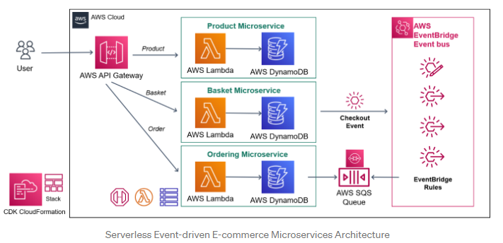

# ServerlessMicroservice
This is a microservice for an ecommerce application using the AWS Serverless Services

- AWS API Gateway
- AWS Lambda
- AWS DynamoDB'
- AWS SQS
- AWS Eventbridge

The `cdk.json` file tells the CDK Toolkit how to execute your app.

## Useful commands

* `npm run build`   compile typescript to js
* `npm run watch`   watch for changes and compile
* `npm run test`    perform the jest unit tests
* `cdk deploy`      deploy this stack to your default AWS account/region
* `cdk diff`        compare deployed stack with current state
* `cdk synth`       emits the synthesized CloudFormation template
